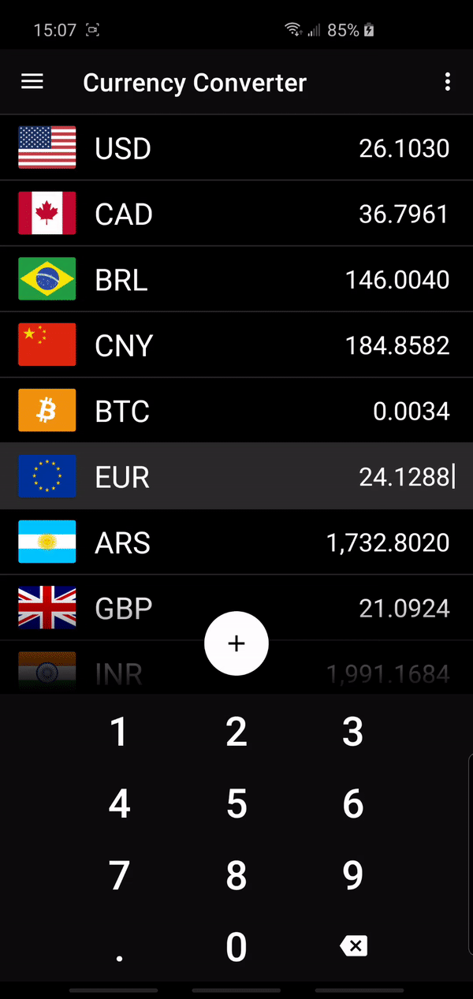

## Currency Converter
Currency conversion tool using live exchange rates.

### Installation
<a href="https://play.google.com/store/apps/details?id=com.nicoqueijo.android.currencyconverter" target="_blank">

</a>

### Demo
<p float="left">
  
  
  
   
</p>

### Screenshots
https://github.com/nicoqueijo/Android-Currency-Converter/tree/master/graphics/screenshots

### API used
https://openexchangerates.org/

### Architecture
This app implements the MVVM architectural pattern using a single activity with fragment-swapping and data-caching using a repository to fetch local or remote data. 


### Dependency Graph


### Built with
* <a href="https://developer.android.com/topic/libraries/architecture/viewmodel" target="_blank">ViewModel</a> - A class designed to store and manage UI-related data in a lifecycle conscious way.
* <a href="https://developer.android.com/topic/libraries/architecture/livedata" target="_blank">LiveData</a> - An observable data holder class.
* <a href="https://kotlinlang.org/docs/reference/coroutines-overview.html" target="_blank">Coroutines</a> - A great new feature of Kotlin which allow you to write asynchronous code in a sequential fashion.
* <a href="https://developer.android.com/topic/libraries/architecture/room" target="_blank">Room</a> - An abstraction layer over SQLite to allow fluent database access while harnessing the full power of SQLite.
* <a href="https://dagger.dev/hilt" target="_blank">Dagger-Hilt</a> - A dependency injection library for Android that reduces the boilerplate of doing manual dependency injection in your project.
* <a href="https://square.github.io/retrofit" target="_blank">Retrofit</a> - Type-safe HTTP client for Android and Java by Square, Inc.
* <a href="https://developer.android.com/guide/navigation" target="_blank">Navigation</a> - A library that can manage complex navigation, transition animation, deep linking, and compile-time checked argument passing between the screens in your app.
* <a href="https://developer.android.com/topic/libraries/data-binding" target="_blank">Data Binding</a> - A support library that allows you to bind UI components in your layouts to data sources in your app using a declarative format rather than programmatically.
* <a href="https://github.com/square/moshi" target="_blank">Moshi</a> - A modern JSON library for Android and Java.
* <a href="https://developers.google.com/admob/android/quick-start" target="_blank">Google AdMob</a> - A mobile advertising platform that you can use to generate revenue from your app.
* <a href="https://developer.android.com/google/play/billing/billing_library_overview" target="_blank">Google Play Billing</a> - A service that lets you sell digital content on Android.
* <a href="https://github.com/anjlab/android-inapp-billing-v3" target="_blank">Android In-App Billing v3</a> - A simple, straight-forward implementation of the Android v3 In-app billing API.
* <a href="https://github.com/bosphere/Android-FadingEdgeLayout" target="_blank">FadingEdgeLayout</a> - A versatile layout that fades its edges regardless of child view type.
* <a href="https://github.com/justasm/DragLinearLayout" target="_blank">DragLinearLayout</a> - An Android LinearLayout that supports draggable and swappable child Views.
* <a href="https://github.com/FutureMind/recycler-fast-scroll" target="_blank">Recycler Bubble</a> - Provides fast scroll and section indexer for recycler view.
* <a href="https://github.com/KeepSafe/TapTargetView" target="_blank">TapTargetView</a> - An implementation of tap targets from Google's Material Design guidelines on feature discovery.
* <a href="https://github.com/junit-team/junit5" target="_blank">JUnit 5</a> - The most widely used testing framework for Java applications.
* <a href="https://github.com/google/truth" target="_blank">Truth</a> - A library that makes your test assertions and failure messages more readable.


### Acknowledgments
* App icon made by Freepik from www.flaticon.com

### License
```
 Copyright 2020 Nicolas Queijo

   Licensed under the Apache License, Version 2.0 (the "License");
   you may not use this file except in compliance with the License.
   You may obtain a copy of the License at

     http://www.apache.org/licenses/LICENSE-2.0

   Unless required by applicable law or agreed to in writing, software
   distributed under the License is distributed on an "AS IS" BASIS,
   WITHOUT WARRANTIES OR CONDITIONS OF ANY KIND, either express or implied.
   See the License for the specific language governing permissions and
   limitations under the License.
