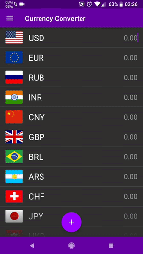
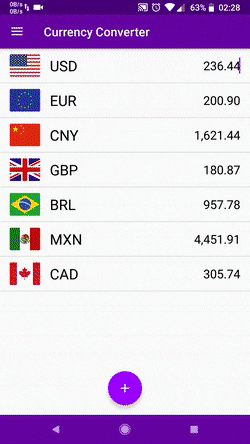

# Currency Converter
Currency conversion tool using live exchange rates.

## Installation

## Demo

  
   

## Features
* Conversions use real time exchange rate values
* Simple Material Design
* Languages: English/Spanish
* Themes: Light/Dark
* Swipe to delete
* Drag to reorder
* Filter by name

## Screenshots
https://github.com/nicoqueijo/Android-Currency-Converter/graphics/screenshots/

## Built with
* <a href="https://github.com/google/volley" target="_blank">Volley</a> - An HTTP library that makes networking for Android apps easier and, most importantly, faster.
* <a href="https://github.com/bosphere/Android-FadingEdgeLayout" target="_blank">FadingEdgeLayout</a> - A versatile layout that fades its edges regardless of child view type.
* <a href="https://github.com/turing-tech/MaterialScrollBar" target="_blank">MaterialScrollBar</a> - An Android library that brings the Material Design 5.1 scrollbar to pre-5.1 devices. Designed for Android's recyclerView.

## Acknowledgments
* App icon made by Freepik from www.flaticon.com
